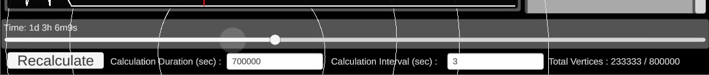

# GUMARATI Space Simulator

An Orbital Rocket Simulator made in the Unity Engine by Gabriel Rayo of STEM-12C of DLSU-IS Laguna. [**Download link.**](https://drive.google.com/drive/folders/1KPA_1zHkWVxv1CWJxCJcCPKdzWi2ozVA)

# Table of Contents

- [GUMARATI Space Simulator](#gumarati-space-simulator)
- [Table of Contents](#table-of-contents)
- [The Simulator Guide](#the-simulator-guide)
- [Main Display](#main-display)
- [Time Settings](#time-settings)
- [Editor / Display Graphs](#editor--display-graphs)
- [Graph Show / Hide buttons (Top left)](#graph-show--hide-buttons-top-left)
- [Thrust Editor Graph](#thrust-editor-graph)
	- [Known issues](#known-issues)
- [Rotation Display Graph](#rotation-display-graph)
- [Angular Thrust Editor Graph](#angular-thrust-editor-graph)
	- [Known issues](#known-issues-1)
- [Editor / Display Windows](#editor--display-windows)
- [Orbit Offsetter Window](#orbit-offsetter-window)
	- [Known issues](#known-issues-2)
- [Info at Time Display Window](#info-at-time-display-window)
- [Start Longitude Window](#start-longitude-window)
	- [Known issues](#known-issues-3)
	- [Examples](#examples)

# The Simulator Guide

# Main Display

-   **Lines** - represents the trajectory of an object
-   **Red line** - selected object trajectory
-   **Translucent circle buttons** - represents an object. Click to select an object and highlight a trajectory

# Time Settings

-   **Time (slider)** - Represents the current time that the main display is displaying. Can be adjusted
-   **Calculation Duration (input field)** - The total time in seconds that the simulator will calculate
-   **Calculation Interval (input field)** - The time gap between each vertex in the trajectory line
-   **Total vertices (text display)** - Displays the total vertices that will be made given the calculation duration and calculator interval. Maximum vertices is 800,000. The "Recalculate" button will be disabled when the value exceeds maximum
-   **Recalculate (button)** - Update the main display when changes are made in the editor graphs, editor windows, calculate duration, or calculation interval

# Editor / Display Graphs

_Editor / Display graphs are togglable so that the main display will be less obstructed when you are only editing / viewing a select number of graphs. Editor graphs are made of_ **_adjustment keys_** _which translates into_ **_points_** _of a_ **_line graph_**

# Graph Show / Hide buttons (Top left)

-   **Thrust (button)** - Toggles the thrust editor graph
-   **Angular Thrust (button)** - Toggles the angular thrust editor graph
-   **Rotation (button)** - Toggles the rotation display graph

# Thrust Editor Graph

-   **Indicator** - The red line in the middle of the graph that corresponds to the specific moment in time that the main dispay is showing
-   **Thrust on Time (slider)** - Adjusts the value of the thrust at the current time on the indicator. This will create a new key on the indicator if there is not one existing already
-   **Previous ("<" button)** - Moves the time slider to the time of the key before the current time
-   **Next (">" button)** - Moves the time slider to the time of the key after the current time

## Known issues

-   Using the **previous** and **next** buttons sometimes tirggers the **Thrust on Time** slider to a 100% value. Whenever this happens, simply uses the **Delete** button to delete the accidentally created key

# Rotation Display Graph

-   **Indicator** - The red line in the middle of the graph that corresponds to the specific moment in time that the main display is showing. The indicator also rotates according to the ship's rotation at time
-   **Angle (text display)** - Displays the current angle of the ship at the displayed time. The zero valyue corresponds to the right, and positive 90 degrees is up
-   **Angular Velocity (text display)** - Displays the current angular velocity of the ship at the displayed time.

# Angular Thrust Editor Graph

-   **Indicator** - The red line in the middle of the graph that corresponds to the specific moment in time that the main display is showing
-   **Angular Thrust on Time (slider)** - Adjusts the value of the thrust at the current time on the indicator. This will create a new key ont he indicator if there is not one existing already
    -   A positive value will torque the ship counter-clockwise
    -   A negative value will torque the ship clockwise
-   **Previous** ("<" button) - Moves the time slider to the time of the key before the current time
-   **Next** (">" button) - Moves the time slider to the time of the key after the current time
-   **Delete (button)** - Deletes the current key in which the current time is at. Cannot be clicked if there is no key exactly on the indicator
-   **Auto Thruster Angular Drag (toggle button)** - When on: the software automatically eases the angular velocity of the ship to zero at recalculation

## Known issues

-   Using the **previous** and **next** buttons sometimes triggers the **Angular Thrust on Time** slider to a 100% value. Whenever this happens, simply use the **Delete** button to delete the accidentally created key

# Editor / Display Windows

_Editor / Display graphs are_ **not** _togglable. They are more compact because they do not need large graphs to span the entire length of the screen_

# Orbit Offsetter Window

-   This offsets the orbit of your selected planet or celestial body but **not** your rocket
-   The **knob's** value corresponds to the value of the **input field**
-   Input values on the **input field** to get more accurate values
-   Click the **Apply** button to permanently change the orbit offset of the selected body. If the **Apply** button is not pressed, when you click other orbits or click recalculate, your changes will be reverted

## Known issues

-   The input field is locked until you adjust the knob at least once in the program

# Info at Time Display Window

-   Displays the basic information of your selected object at the specific time is being displayed
-   Consists of: **name, mass, position, velocity, force, angle, angular velocity, torque**
-   When you selected the ship when a trajectory has not been calculated yet, a "**Null trajectory**" will be displayed instead.

# Start Longitude Window

-   This adjusts the ship's starting longitude and direction on the planet earth
-   The **knob's** value corresponds to the value on the **input field**
-   Input values on the **input field** to get more accurate values
-   The value corresponds to the ship's angle relative to the main display. The zero value is right, and positive 90 degrees is up

## Known issues

-   The input field is locked until you adjust the knob at least once in the program

## Examples

