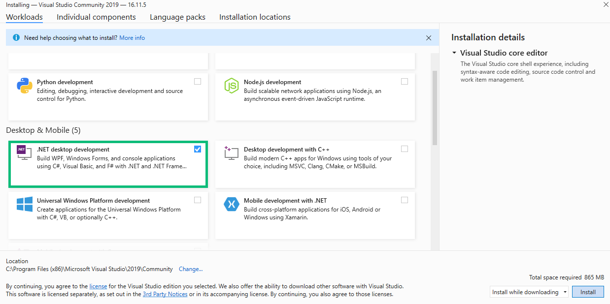
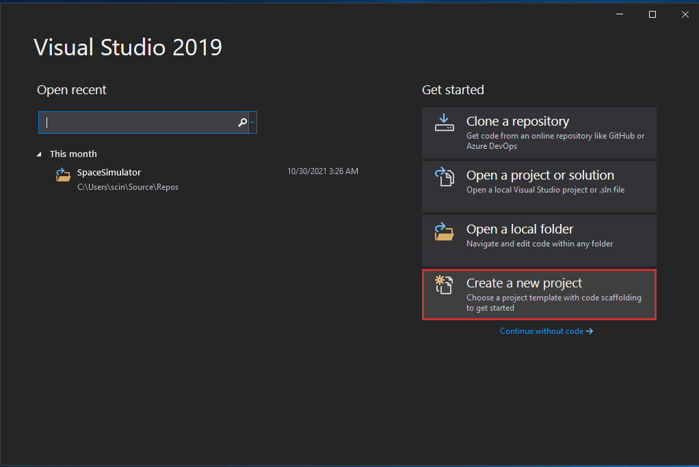
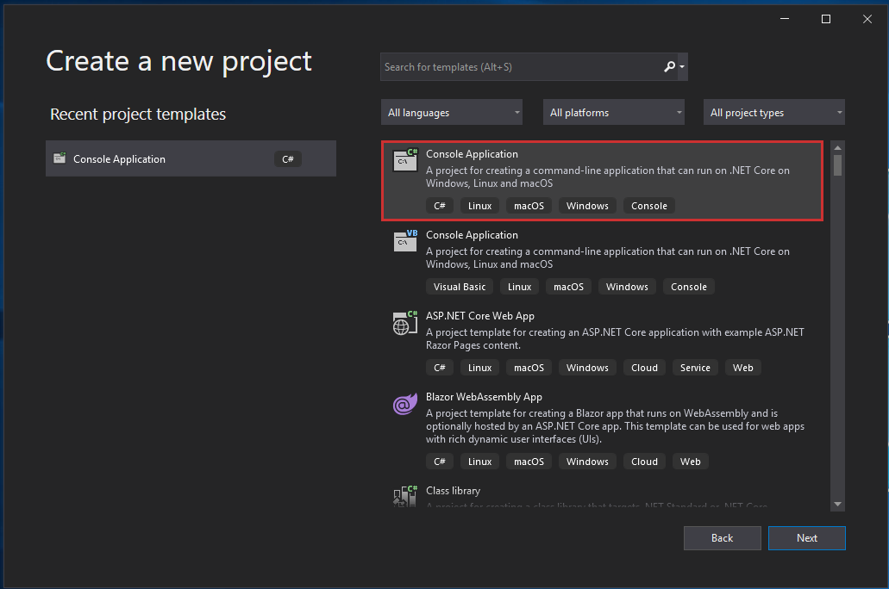
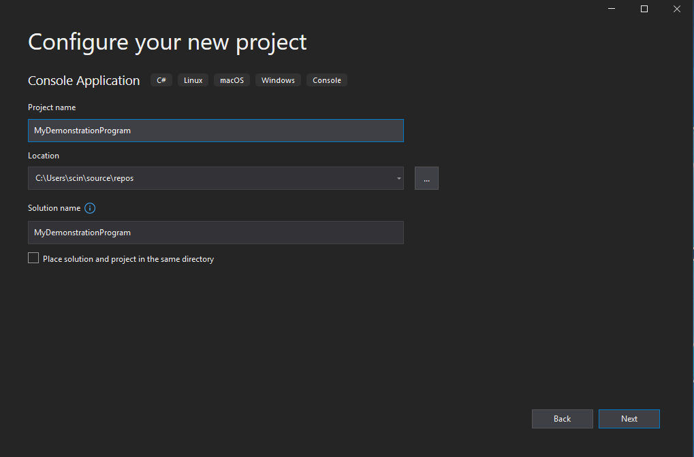
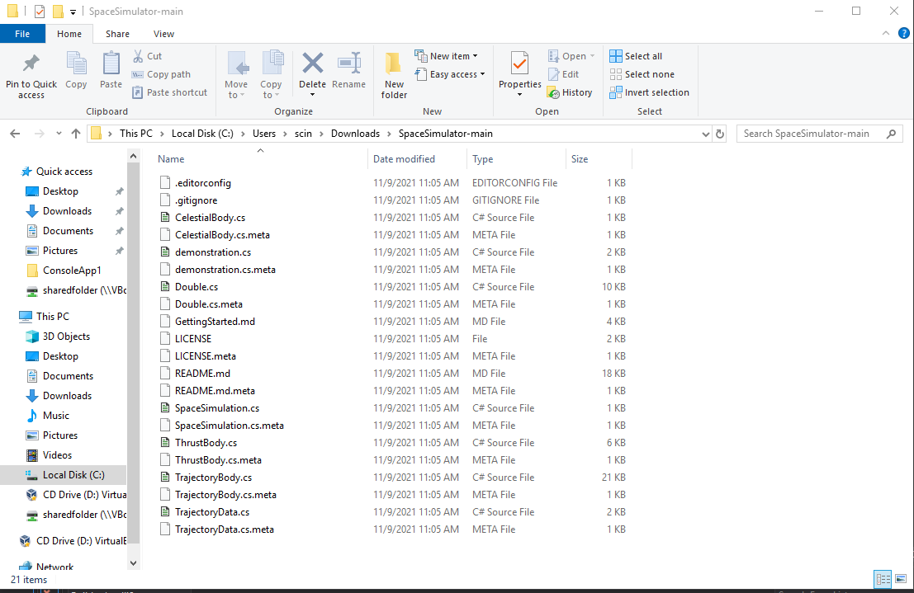
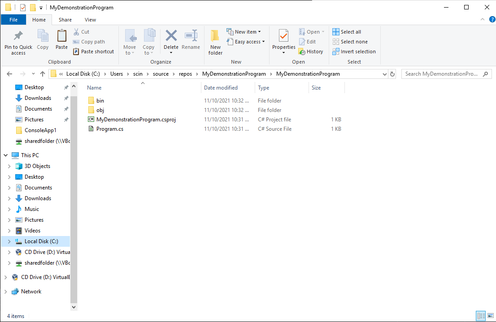
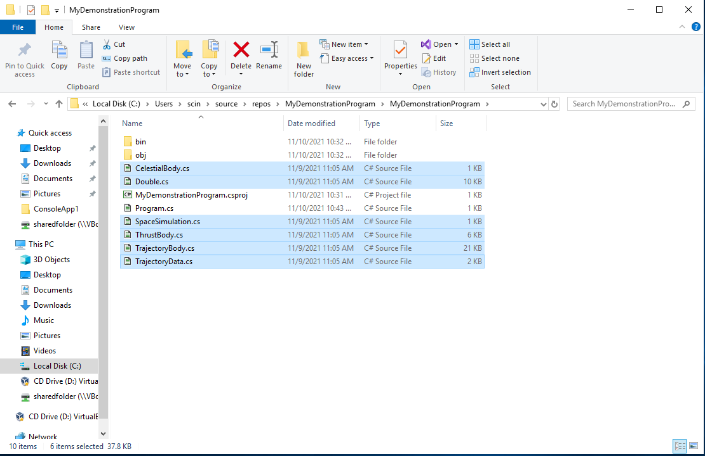
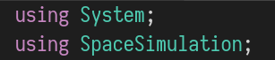
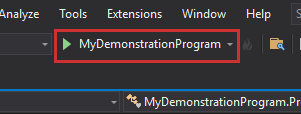
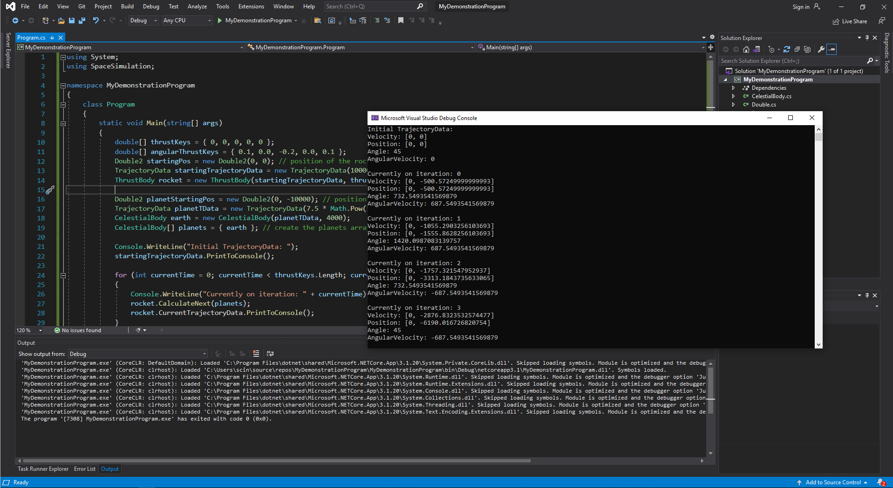

# SpaceSimulator

A classical mechanics code library written in C# for calculating gravity, laws of motion, thrust and angular momentum. [**Download link.**](https://github.com/Cybalt-SR/SpaceSimulator/archive/refs/heads/main.zip)

Written by Gabriel Rayo and Lance Gulinao of Group GUMARATI from STEM-12C of DLSU-IS Laguna.

# Table of Contents

- [SpaceSimulator](#spacesimulator)
- [Table of Contents](#table-of-contents)
- [Getting Started](#getting-started)
	- [Creating a C# Application in Visual Studio 2019](#creating-a-c-application-in-visual-studio-2019)
	- [Importing the Library in your C# Application](#importing-the-library-in-your-c-application)
- [Working with the Library](#working-with-the-library)
	- [Creating initial trajectory data](#creating-initial-trajectory-data)
	- [Creating planets](#creating-planets)
	- [Creating rockets](#creating-rockets)
	- [The actual calculation](#the-actual-calculation)
		- [Combining everything](#combining-everything)
		- [Running the Program](#running-the-program)

# Getting Started

## Creating a C# Application in Visual Studio 2019

To get started with the code library,
Install Visual Studio 2019 with support for .NET desktop development under the "Desktop & Mobile section".



After that, follow these steps to add the code library in to your C# application:

1. Open Visual Studio 2019 and click on Create a new Project:
   
2. On the right side of the window, click on "Console Application" making sure that it has "C#" as one of the tags. Then hit the Next button.
   
3. In this screen, you can nake what you're project is going to be called. For this demonstration, the project name is going to be "MyDemonstrationProgram". Once you have decided on a name for your project, click on the Next button, then Create.
   

## Importing the Library in your C# Application

1. Download and extract the ZIP file which contains the code library. After going into the extracted folder you should see the following files:
   
2. On a new window, go to the folder containing the Visual Studio project you just created. It should be under `C:\Users\<username>\user\source\repos\MyDemonstrationProgram\MyDemonstrationProgram`.
   
3. Copy and paste all the files ending in .cs except demonstration.cs, from the extracted folder and into the project folder. Your project folder should look like this afterwards:
   
4. To get access to the library, add a `using` directive for the `SpaceSimulation` namespace in the Program.cs file.
   

# Working with the Library

This code library makes it easier for you to simulate the behaviour of rocket and planets in space

Rockets are represented using a class called ThrustBody, planets are represented using a class called CelestialBody, and their trajectory is represented using a struct called TrajectoryData.

These classes and structs allow you to simulate a wide range of scenarios that may occur in space. Don't worry, you don't need to know the difference between classes and structs in order to use this code library.

## Creating initial trajectory data

In order to create a rocket and planet, we first have to initiate their initial trajectory data, this will hold the initial information about their mass, position, velocity, angle, and angular velocity.

```cs
// the object will start 50 meters above and away from the origin
Double2 startingPos = new Double2(50, 50);
// and it won't have any horizontal or vertical velocity
Double2 startingVelocity = new Double2(0, 0);

TrajectoryData initialTrajectory = new TrajectoryData(
	mass,					// mass of the object in kg
	startingPos,			// a Double2 of the object's position
	startingVelocity,		// a Double2 of the object's velocity
	startingAngle,			// angle of the object in degrees
	startingAngularVelocity	// angle of the object in degrees/second
);
```

Generally, a Double2 is used to store information that can be broken down to horizontal and vertical components, like position, velocity, and acceleration

## Creating planets

We can then use the initial trajectory in creating planets:

```cs
CelestialBody earth = new CelestialBody(
	earthInitialTrajectory,	// the initial trajectory of earth
	earthRadius				// the radius of earth
);

// you can repeat the above code for as many planets as you want
// then we can create an array of CelestialBody to represent planets
CelestialBody[] planets = { earth };
```

## Creating rockets

We also use the initial trajectory to create rockets, but aside from that we also have to define the rocket's linear and angular thrust

```cs
//         Time |    1s |    2s |    3s |    4s |    5s |
// Thrust Level |    0% |   20% |   40% |   60% |   80% |
double[] thrustKeys = {0, 0.2, 0.4, 0.6, 0.8};

//         Time |    0s |    1s |    2s |    3s |    4s |
// Thrust Level |    0% |   10% |    0% |   20% |    0% |
//    Direction |  None |  Left |  None | Right |  None |
double[] angularThrustKeys = {0, 0.1, 0.0, -0.2, 0.0};

ThrustBody rocket = new ThrustBody(
	rocketInitialTrajectory,
	thrustKeys,
	angularThrustKeys,
	rocketLength,			// rocket length in meters
	exhaustVelocity,		// rocket exhaust velocity in m/s
	fuelBurnRate			// rocket fuel burn rate in kg/s
)
```

## The actual calculation

Once we have created a rocket and the planets that are included in our simulation, we can begin calculating it's trajectory

```cs
int iterations = 60; // the number of seconds to calculate
for(int currentTime = 0; currentTime < iterations; currentTime++){
	// print what iteration it is currently calculating for
	Console.WriteLine("Currently on iteration: " + currentTime);

	// calculate the next trajectory with a list of planets to take into consideration
	rocket.CalculateNext(planets);

	// print the trajectoryData
	rocket.CurrentTrajectoryData.PrintToConsole();
}
```

### Combining everything

So if we combined the small blocks of code above, we get the following

```cs
using System;
using SpaceSimulation;

namespace MyDemonstrationProgram
{
	class Program
	{
		static void Main(string[] args){
			double[] thrustKeys = { 0, 0, 0, 0, 0 };
			double[] angularThrustKeys = { 0.1, 0.0, -0.2, 0.0, 0.1 };
			Double2 startingPos = new Double2(0, 0); // position of the rocket
			TrajectoryData startingTrajectoryData = new TrajectoryData(10000, startingPos, Double2.Zero, 45, 0);
			ThrustBody rocket = new ThrustBody(startingTrajectoryData, thrustKeys, angularThrustKeys, 1, 1000, 1000);

			Double2 planetStartingPos = new Double2(0, -10000); // position of the planet
			TrajectoryData planetTData = new TrajectoryData(7.5 * Math.Pow(10, 20), planetStartingPos, Double2.Zero, 0, 0);
			CelestialBody earth = new CelestialBody(planetTData, 4000);
			CelestialBody[] planets = { earth }; // create the planets array with only one planet as the item

			Console.WriteLine("Initial TrajectoryData: ");
			startingTrajectoryData.PrintToConsole();

			int iterations =60; // the number of seconds to calculate
			for (int currentTime = 0; currentTime < iterations; currentTime++) {
				Console.WriteLine("Currently on iteration: " + currentTime);
				rocket.CalculateNext(planets);
				rocket.CurrentTrajectoryData.PrintToConsole();
			}
		}
	}
}
```

### Running the Program

Now that we've written our first program that utilizes the library, we should test if it runs. Inside Visual Studio, we can compile the program by pressing the button with the name of the project:



Afterwards, we should see our code compile and run, where the output is displayed in a command prompt window:

